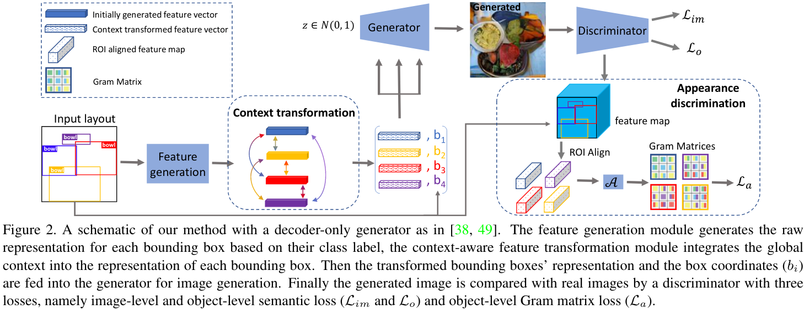

# layout2img
This repository includes the implementation for [Context-Aware Layout to Image Generation with Enhanced Object Appearance](https://arxiv.org/abs/2103.11897) (to appear in CVPR 2021).

This repo is not completely.

## Network Structure



## Requirements
* python3
* pytorch >1.0
* numpy
* matplotlib
* opencv

Or install full requirements by running:
```bash
pip install -r requirements.txt
```

## TODO
- [x] instruction to prepare dataset
- [ ] remove all unnecessary files
- [x] add link to download our pre-trained model
- [ ] clean code including comments
- [ ] instruction for training
- [ ] instruction for evaluation
- [ ] instruction for applying our methods in [layout2img](https://github.com/zhaobozb/layout2im)

## Training ImageTransformer

### Data Preparation
Download COCO dataset to datasets/coco
```bash
bash scripts/download_coco.sh
```
Download VG dataset to datasets/vg
```bash
bash scripts/download_vg.sh
python scripts/preprocess_vg.py
```


### Start training


See `opts.py` for the options.


### Evaluation


### Trained model
you can download our trained model from our [onedrive repo](https://1drv.ms/u/s!At2RxWvE6z1zgvEO2U1cvAL74id2Ng?e=tNPag5)

### Performance
You will get the scores close to below after training for around 200 epochs:

| models  | Resolutions | IS-COCO     | IS-VG       | FID-COCO | FID-VG |
|---------|-------------|-------------|-------------|----------|--------|
| Ours-ED | 64*64       | 15.27+/-.25 | 8.53+/-.13  | 31.32    | 33.91  |
| Ours-D  | 128*128     | 15.62+/-.05 | 12.69+/-.45 | 22.32    | 21.78  |

## Reference

If you find this repo helpful, please consider citing:

```
@inproceedings{he2021context,
  title={Context-Aware Layout to Image Generation with Enhanced Object Appearance},
  author={He, Sen and Liao, Wentong and Yang, Michael and Yang, Yongxin and Song, Yi-Zhe and Rosenhahn, Bodo and Xiang, Tao},
  booktitle={CVPR},
  year={2021}
}
```

## Acknowledgements

This repository is based on [LostGAN](https://github.com/WillSuen/LostGANs), and the propsoed modules can be applied in the [layout2img](https://github.com/zhaobozb/layout2im).
